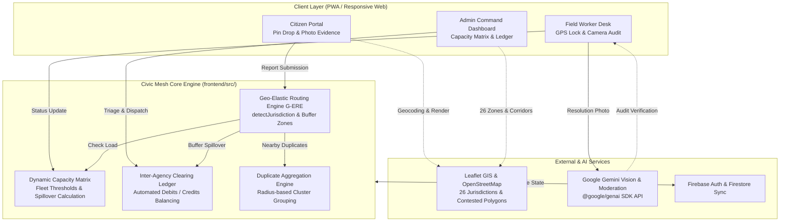
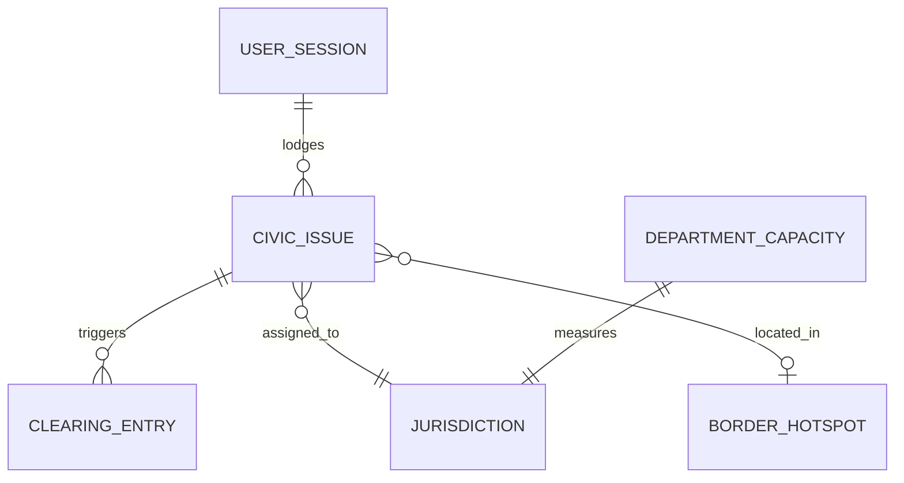

# Architecture

[← Back to README](../README.md)

## System Diagram

## Request Walkthrough

1. **Citizen Complaint Intake**: Citizen selects a category, drops an exact pin on the interactive Mysuru map, captures live photo proof, and submits.
2. **Geospatial & Boundary Analysis**: `detectJurisdiction()` evaluates coordinates against the 26 civic zones and 5 contested buffer corridor polygons (e.g., Bogadi - MCC Zone 3 boundary).
3. **Dynamic Fleet Capacity Evaluation**: `calculateDynamicCapacities()` queries live tasks against zonal tipper trucks and worker pools. If the primary zone is overloaded (>100% capacity), Geo-Elastic spillover routing activates.
4. **Inter-Agency Ledger Entry**: The spillover ticket is assigned to the nearest idle municipal depot (e.g., MCC Zone 3 at ~45% load). `calculateClearingLedger()` writes an automatic financial debit to Bogadi and a credit to MCC Zone 3.
5. **Worker Execution with GPS Lock**: The assigned field crew travels to the site. The worker desk enforces a 50-meter GPS proximity lock before enabling the resolution camera.
6. **AI Vision Resolution Audit**: The worker's completion photo is verified by Google Gemini 2.5/3.6 Flash via `@google/genai` to ensure real civic remediation and reject fake/indoor photos.
7. **Resolution & Feedback**: The ticket status transitions to `resolved`, and the citizen views the before-and-after proof with an interactive 5-star rating feedback loop.

## Components

| Component | Responsibility | Tech | Code location |
|---|---|---|---|
| Citizen Portal | Public intake, pin drop, local search, photo upload, duplicate alerts, tracking feed | React 19, Leaflet, Tailwind CSS | `frontend/src/components/CitizenPortal.tsx` |
| Field Worker Desk | Distraction-free task list, GPS distance lock, live camera audit, bilingual Kannada/English | React 19, Camera API, Lucide | `frontend/src/components/WorkerDesk.tsx` |
| Admin Command Portal | 26-zone capacity matrix, GIS corridor map, inter-agency ledger, manual triage modal | React 19, Leaflet, SVG Charts | `frontend/src/components/AdminDashboard.tsx` |
| Geo-Elastic Routing Engine | Bounding envelope detection, capacity-based spillover, buffer coordination | TypeScript | `frontend/src/mockDatabase.ts` |
| Inter-Agency Clearing Ledger | Automated cost balancing between MCC and rural panchayats, voucher issuance | TypeScript | `frontend/src/mockDatabase.ts` |
| AI Verification Service | Multimodal civic repair audit and citizen complaint text moderation | Google Gemini API (`@google/genai`) | `frontend/src/utils/geminiVerification.ts` |
| Geospatial Mapping Engine | 26 jurisdictional circle layers, 5 contested polygons, interactive ticket pins | Leaflet.js, OpenStreetMap | `frontend/src/components/AdminLeafletMap.tsx`, `frontend/src/components/MysuruLeafletMap.tsx` |

## Data Model

| Entity | Key fields | Notes |
|---|---|---|
| `CivicIssue` | `id, trackingId, title, category, location, coordinates, status, severityRank, isBufferZone, assignedDepot, workerProofPhoto, citizenRating` | Central record for civic grievance, lifecycle states, and verified repair photos. |
| `Jurisdiction` | `id, name, type (mcc_zone, town_panchayat, gram_panchayat, buffer_zone), center, radius, baseWorkers, baseTrucks, color` | Defines all 26 administrative zones across Mysuru urban and rural districts. |
| `DepartmentCapacity` | `jurisdictionId, activeTasks, capacityPercent, status, availableTrucks, idleWorkers` | Dynamically calculated real-time workload matrix per civic agency. |
| `ClearingLedgerEntry` | `debtorJurisdiction, creditorJurisdiction, ticketCount, totalDebtRupees, tickets` | Inter-agency financial clearing ledger balancing cross-border spillover fuel and equipment costs. |
| `BorderHotspot` | `id, name, contestedBetween, center, radius, polygonCoords, priorityLevel` | Contested buffer zone definitions covering Ring Road and urban-rural fringe corridors. |

## Key APIs & Function Handlers

| Handler / Function | Interface | Purpose | Auth / Role |
|---|---|---|---|
| `submitCitizenReport` | `(data) => SubmitReportResult` | Submits complaint, validates duplicate clusters within 50m, runs G-ERE routing | Public Citizen / Anonymous |
| `detectJurisdiction` | `(coords) => Jurisdiction` | Resolves exact GPS coordinates to one of 26 civic zones or buffer corridors | Internal Routing Engine |
| `calculateDynamicCapacities` | `(issues) => DepartmentCapacity[]` | Recalculates fleet load across all 21 operational depots based on active tasks | Real-time Engine |
| `calculateClearingLedger` | `(issues) => ClearingLedgerEntry[]` | Computes financial debits and credits between debtor and creditor jurisdictions | Admin / Inter-Agency |
| `verifyResolutionImageWithGemini`| `(base64Image, category) => AuditResult` | Multimodal AI audit checking before/after repair proof against civic criteria | Field Worker Desk |
| `moderateCitizenSubmission` | `(title, description) => ModerationResult` | Content policy moderation flagging profanity, harassment, or gibberish | Public Citizen Intake |
| `adminUpdateIssue` | `(id, updates) => CivicIssue` | Administrative manual override, reassignment, status change, and crew dispatch | Zonal Officer / Admin |

## Tech Stack

| Layer | Choice | Why this over alternatives |
|---|---|---|
| Frontend | React 19 + TypeScript + Vite | Blazing fast client rendering, strict type safety for civic data, instant hot module reload. |
| Styling | Tailwind CSS v4 + Vanilla CSS Design Tokens | High-contrast tactile design system, responsive mobile layouts, clean dark/light mode. |
| Geospatial GIS | Leaflet.js + OpenStreetMap Tiles | Zero-cost, lightweight, open-source cartography with support for custom circle and polygon overlays. |
| AI / Vision | Google Gemini 2.5 / 3.6 Flash via `@google/genai` | Fast multimodal vision inference, low latency, structured JSON output for automated audit decisions. |
| State & Auth | Firebase Auth + Modular Mock Database Engine | Hybrid local-first engine with offline resilience and optional Firestore cloud synchronization. |
| Bundler & Tooling | Vite 8 + npm | Instant development feedback and optimized production bundle under 1.5 MB. |

## Data Sources

| Dataset | Source & licence | Real or synthetic | Used for |
|---|---|---|---|
| Mysuru Civic Zones (26 Jurisdictions) | Mysuru City Corporation (MCC) & District Panchayat boundary records | Real spatial boundaries with synthesized operational centers | Defining administrative boundaries and depot allocations. |
| Contested Buffer Corridors | OpenStreetMap Outer Ring Road & MUDA transitional master plans | Real GPS coordinates with synthetic buffer envelopes | Simulating boundary disputes along Bogadi, Hootagalli, Rammanahalli, Kadakola, and Alanahalli. |
| Mysuru Landmarks & Circles | Public Karnataka GIS (KGIS) and OpenStreetMap POI data | Real coordinates and street names | Fast landmark and circle search dropdown (KR Circle, Ballal Circle, Devaraja Market, etc.). |
| Baseline Grievance Callset | Synthesized based on municipal report patterns | Synthetic test dataset (18 seed tickets) | Validating capacity matrix thresholds, G-ERE spillover, and ledger calculations out-of-the-box. |
