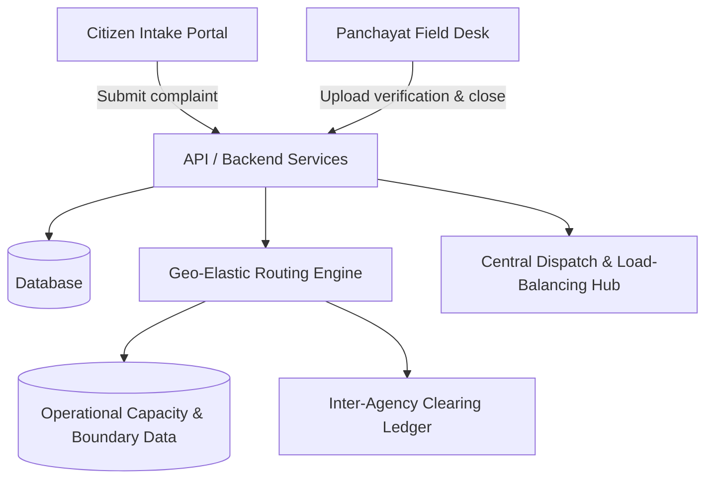
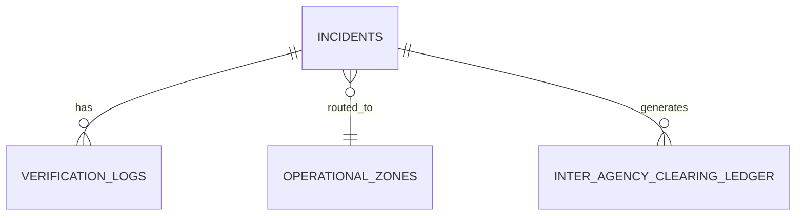

# Architecture

[← Back to README](../README.md)

## System Diagram

## Request Walkthrough

1. Citizen drops a pin, selects an issue category, and submits a photo on the Citizen Intake Portal.
2. The system auto-calculates an objective severity rank (1 to 5) based on the category and location.
3. The Geo-Elastic Routing Engine evaluates if the pin falls within a fuzzy border zone and checks the home zone's real-time capacity.
4. If the home zone is overloaded (over 100 percent capacity), the system spillover-routes the ticket to the nearest underloaded depot and logs a financial transaction in the Inter-Agency Clearing Ledger.
5. The assigned field worker receives a map-free, distraction-free task in their queue, travels to the site, and closes the ticket using a GPS-locked native camera capture within a 50 meter radius.

## Components

| Component | Responsibility | Tech | Code location |
|---|---|---|---|
| Citizen Intake Portal | Clean mapping interface for citizens to drop pins and submit issues | `<Frontend Tech Pending>` | `src/frontend/citizen` |
| Central Dispatch Hub | Zonal capacity visualization, dynamic routing engine, inter-agency ledger | `<Frontend Tech Pending>` | `src/frontend/dispatch` |
| Panchayat Field Desk | Actionable task queue without maps, GPS-locked photo verification | `<Frontend Tech Pending>` | `src/frontend/worker` |
| API Server | Handles all requests, processes logic, manages database | `<Backend Tech Pending>` | `src/backend/api` |
| Routing Service | Geo-Elastic routing, capacity engine, severity calculations | `<Backend Tech Pending>` | `src/backend/services/routing` |
| Data Store | Stores incidents, zone data, ledgers, verification logs | `<Database Tech Pending>` | `src/backend/db` |

## Data Model

| Entity | Key fields | Notes |
|---|---|---|
| `incidents` | `id, tracking_code, latitude, longitude, category, severity_rank, status` | Core grievance data |
| `operational_zones` | `zone_id, name, tipper_trucks_active, current_capacity_pct` | Tracks capacity and fleet |
| `inter_agency_clearing_ledger` | `entry_id, debtor_zone_id, creditor_zone_id, clearing_cost_inr` | Inter-agency cost sharing |
| `verification_logs` | `log_id, worker_id, closure_latitude, distance_from_origin_meters` | Worker closure records |

## Key APIs

| Method | Endpoint | Purpose | Auth |
|---|---|---|---|
| `POST` | `/api/complaints` | Submit a new grievance | Anonymous / Token |
| `GET` | `/api/zones/capacity` | Fetch real-time workload data | Admin |
| `POST` | `/api/complaints/:id/resolve` | Close a task with GPS and photo | Worker |
| `GET` | `/api/ledger/transactions` | View inter-agency cost transfers | Admin |

## Tech Stack

| Layer | Choice | Why this over alternatives |
|---|---|---|
| Frontend | `<Frontend Tech Pending>` | `<...>` |
| Backend | `<Firebase / Backend Tech Pending>` | `<...>` |
| Database | `<Database Tech Pending>` | `<...>` |
| ML / AI | `<Pending>` | `<...>` |

## Data Sources

| Dataset | Source & licence | Real or synthetic | Used for |
|---|---|---|---|
| Ward boundaries | MCC Gazette updates | Real | Creating the fuzzy buffer zones and mapping contested territories. |
| Road networks | OpenStreetMap | Real | Visualizing streets and calculating distances. |
