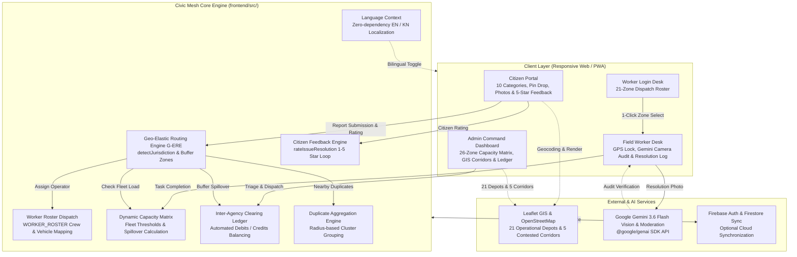
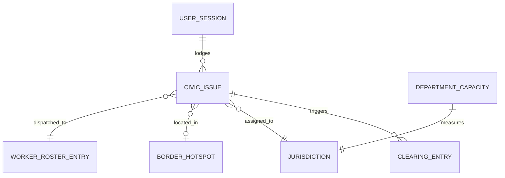

# Architecture

[← Back to README](../README.md)

## System Diagram

## Request Walkthrough

1. **Citizen Grievance Intake**: Citizen chooses from 10 standardized municipal categories, drops an exact pin on the interactive Mysuru map (or selects a quick border preset like Bogadi Ring Road Junction), uploads photo evidence, and submits.
2. **Geospatial & Boundary Analysis**: `detectJurisdiction()` and `detectBufferZoneId()` evaluate GPS coordinates against the 21 primary administrative jurisdictions (9 MCC Zones, 4 Town Panchayats, 8 Gram Panchayats) and 5 contested buffer corridor envelopes.
3. **Dynamic Fleet Capacity Evaluation**: `calculateDynamicCapacities()` queries live tasks against zonal fleet thresholds and active worker pools. If the home zone is overloaded (>100% capacity, e.g. Bogadi Town Panchayat at 110%), Geo-Elastic spillover routing activates.
4. **Automated Inter-Agency Ledger Entry**: The spillover ticket is delegated to the adjacent partner depot with available capacity (e.g. MCC Zone 3 at ~43% load). `calculateClearingLedger()` automatically registers an inter-agency financial debit to the debtor jurisdiction and a credit to the creditor jurisdiction.
5. **Dynamic Worker Roster Assignment**: The work order automatically inherits the dedicated field crew lead and utility vehicle mapped to the performing jurisdiction in `WORKER_ROSTER` (e.g., Manjunatha S., Canter KA-09-G-4412 for MCC Zone 3).
6. **Worker Execution with GPS Proximity Lock**: The field operator authenticates via the 1-click dispatch roster. The mobile worker desk enforces a 50-meter GPS proximity lock to the incident site before enabling the resolution camera.
7. **AI Vision Resolution Audit**: The completion photograph is evaluated in real time by Google Gemini 3.6 Flash via `@google/genai`. The model verifies physical municipal repair materials (asphalt, concrete, desilted culverts, luminaire replacement) and strictly rejects non-civic photos (plants, selfies, domestic interiors).
8. **Citizen Feedback Loop**: Once the ticket transitions to `resolved`, the citizen inspects the completion status in the 'My Submissions' tab and submits an interactive 1–5 star rating with optional feedback comments, which immediately updates the municipal satisfaction telemetry in the Admin Command Dashboard.

## Components

| Component | Responsibility | Tech | Code location |
|---|---|---|---|
| Citizen Portal | Public intake across 10 civic categories, pin drop, duplicate alerts, photo upload, bilingual EN/KN, 5-star resolution feedback | React 19, Leaflet, Tailwind CSS | `frontend/src/components/CitizenPortal.tsx` |
| Worker Login Roster | 1-click dispatch roster authentication mapping operators across 21 primary jurisdictions | React 19, Lucide, Tailwind CSS | `frontend/src/components/WorkerLogin.tsx` |
| Field Worker Desk | Distraction-free work order list, GPS proximity lock, live Gemini camera audit, bilingual Kannada/English execution | React 19, HTML5 Camera API, Lucide | `frontend/src/components/WorkerDesk.tsx` |
| Admin Command Dashboard | 26-zone capacity matrix, GIS corridor polygons, inter-agency clearing ledger, citizen satisfaction metrics, incident inspection modal | React 19, Leaflet, SVG Charts | `frontend/src/components/AdminDashboard.tsx` |
| Language Context | Lightweight, zero-dependency bilingual state provider (`'en' \| 'kn'`) with `localStorage` persistence | React 19 Context | `frontend/src/context/LanguageContext.tsx` |
| Geo-Elastic Routing Engine | Bounding envelope detection, capacity-based spillover delegation, corridor routing | TypeScript | `frontend/src/mockDatabase.ts` |
| Inter-Agency Clearing Ledger | Automated cost balancing between MCC and peripheral panchayats, voucher issuance | TypeScript | `frontend/src/mockDatabase.ts` |
| AI Verification Service | Multimodal civic repair audit and citizen complaint text moderation using Gemini 3.6 Flash | Google Gemini API (`@google/genai`) | `frontend/src/utils/geminiVerification.ts` |
| Geospatial Mapping Engine | 21 jurisdictional circles, 5 contested buffer polygons, interactive incident markers | Leaflet.js, OpenStreetMap | `frontend/src/components/AdminLeafletMap.tsx`, `frontend/src/components/MysuruLeafletMap.tsx` |

## Data Model

| Entity | Key fields | Notes |
|---|---|---|
| `CivicIssue` | `id, trackingId, title, category, description, location, coordinates, status, priority, severityRank, isBufferZone, assignedJurisdictionId, assignedCrewLead, assignedVehicle, resolvedImageUrl, citizenRating, citizenFeedback, ratedAt, clearingCost` | Central record for civic grievance lifecycle, assigned fleet crew, before/after photographic proof, and citizen rating feedback. |
| `MysuruJurisdiction` | `id, name, type (mcc_zone, town_panchayat, gram_panchayat), baseWorkers, description, taluk, centerCoords` | Defines all 21 operational administrative jurisdictions across Mysuru urban and rural zones. |
| `BorderHotspot` | `id, name, contestedBetween, center, radius, polygonCoords, priorityLevel` | Defines the 5 contested transitional buffer corridors covering Ring Road and urban-rural fringe zones. |
| `WorkerRosterEntry` | `jurisdictionId, name, vehicle, role, jurisdictionName, zoneType` | Maps each of the 21 operational jurisdictions to a designated field operator profile and utility vehicle. |
| `DepartmentCapacity` | `id, name, activeWorkers, currentLoad, maxCapacity, status ('optimal' \| 'moderate' \| 'overloaded')` | Dynamically calculated real-time workload matrix measuring fleet utilization per civic agency. |
| `ClearingLedgerEntry` | `debtorJurisdiction, creditorJurisdiction, ticketCount, totalDebtRupees, tickets` | Inter-agency financial ledger tracking cross-border spillover liabilities, equipment hours, and fuel debits. |
| `UserSession` | `id, name, role ('citizen' \| 'worker' \| 'admin'), jurisdictionId, jurisdictionName, vehicle, workerRole` | Client session record supporting 1-click citizen profile switching, worker roster login, and admin clearance. |

## Key APIs & Function Handlers

| Handler / Function | Interface | Purpose | Auth / Role |
|---|---|---|---|
| `submitCitizenReport` | `(data) => SubmitReportResult` | Submits complaint, validates duplicate clusters within 50m, executes G-ERE routing, assigns crew lead and vehicle from roster | Public Citizen / Anonymous |
| `detectJurisdiction` | `(locationStr, coords) => string` | Resolves exact GPS coordinates and location strings to one of the 21 operational jurisdictions | Internal Routing Engine |
| `detectBufferZoneId` | `(locationStr, coords) => string \| null` | Checks whether an incident falls within one of the 5 contested transitional boundary envelopes | Internal Routing Engine |
| `routeBufferZoneTicket` | `(bufferId, coords, loadWeight) => RoutingResult` | Computes dynamic spillover between adjacent jurisdictions based on available fleet capacity | G-ERE Engine |
| `calculateDynamicCapacities`| `(issues) => DynamicJurisdictionCapacity[]` | Recalculates fleet load and utilization percentage across all 21 operational depots based on active tasks | Real-time Engine |
| `calculateClearingLedger` | `(issues) => ClearingLedgerEntry[]` | Computes financial debits and credits between debtor and creditor jurisdictions for rerouted tickets | Admin / Inter-Agency |
| `resolveIssueWithProof` | `(id, resolvedImageUrl, notes, cost) => CivicIssue[]` | Completes work order with verified completion photo and resolution notes | Field Worker Desk |
| `rateIssueResolution` | `(id, rating, feedback) => CivicIssue[]` | Submits citizen 1–5 star rating and optional feedback comment for resolved work orders | Citizen Portal |
| `verifyResolutionImageWithGemini`| `(base64Image, taskContext) => Promise<GeminiVerificationResult>` | Multimodal AI audit checking field completion photo against strict civic repair criteria using Gemini 3.6 Flash | Field Worker Desk |
| `moderateCitizenSubmission` | `(title, description) => Promise<ModerationResult>` | Content moderation flagging profanity, harassment, or gibberish in public complaints | Public Citizen Intake |
| `resetToSeedData` | `() => void` | Resets state to initial demo baseline (4 Bogadi tickets, 2 MCC Zone 3 tickets, 0 buffer tickets) with confirmation guardrail | Global Navbar |

## Tech Stack

| Layer | Choice | Why this over alternatives |
|---|---|---|
| Frontend Framework | React 19 + TypeScript + Vite 8 | Blazing fast client rendering, strict type safety for civic data, instant hot module reload. |
| Styling | Tailwind CSS v4 + Design Tokens | High-contrast tactile design system, responsive mobile layouts, clean dark/light mode. |
| Geospatial GIS | Leaflet.js + OpenStreetMap Tiles | Zero-cost, lightweight cartography supporting 21 jurisdictional circles and 5 contested buffer polygons. |
| Multimodal AI | Google Gemini 3.6 Flash via `@google/genai` | Low-latency multimodal vision inference and structured JSON output for automated audit decisions. |
| Localization | Custom React LanguageContext | Lightweight zero-dependency bilingual state provider supporting seamless English and Kannada toggling. |
| State & Persistence | Local-First Architecture + Optional Firebase | Hybrid local-first engine with offline resilience and optional Firestore cloud synchronization. |
| Tooling & Bundler | Vite 8 + npm (`--legacy-peer-deps`) | Instant development feedback and optimized production bundle under 1.5 MB. |

## Data Sources

| Dataset | Source & licence | Real or synthetic | Used for |
|---|---|---|---|
| Mysuru Civic Jurisdictions (21 Depots) | Mysuru City Corporation (MCC) & District Panchayat records | Real spatial boundaries with synthesized operational centers | Defining administrative boundaries and depot allocations across 9 MCC zones, 4 Town Panchayats, and 8 Gram Panchayats. |
| Contested Buffer Corridors (5 Envelopes) | OpenStreetMap Outer Ring Road & MUDA transitional master plans | Real GPS coordinates with synthetic buffer envelopes | Simulating boundary disputes along Bogadi, Hootagalli, Rammanahalli, Kadakola, and Alanahalli. |
| Mysuru Landmarks & Circles | Public Karnataka GIS (KGIS) and OpenStreetMap POI data | Real coordinates and street names | Fast landmark and circle search dropdown (KR Circle, Ballal Circle, Devaraja Market, etc.). |
| Baseline Grievance Callset | Synthesized based on municipal report patterns | Synthetic test dataset (6 seed tickets) | Validating capacity matrix thresholds (Bogadi TP at 110% load, MCC Zone 3 at 43% load, all buffer corridors initialized at 0 tickets). |

